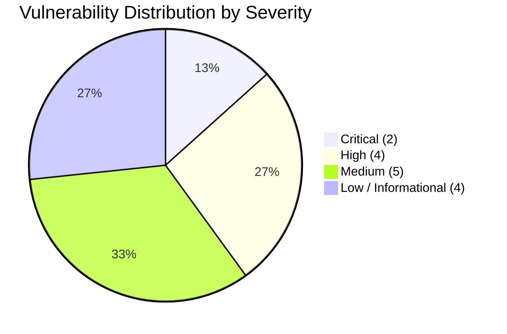
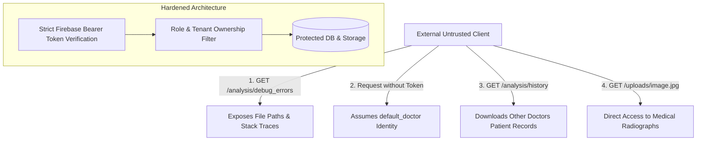
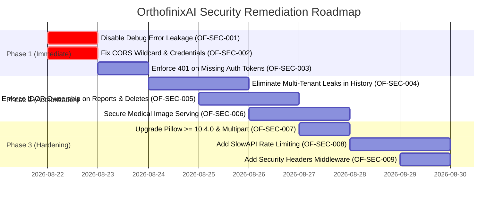

# 🛡️ OrthofinixAI — Comprehensive Backend Security Audit & SAST Review Report

**Date of Audit:** August 2026  
**Audited Target:** OrthofinixAI Clinical Backend & API  
**Review Type:** Defensive Static Application Security Testing (SAST) & Architecture Review  
**Lead Security Auditor:** Antigravity Security Analysis Engine  
**Overall Security Score:** **68 / 100** (Moderate Risk — Remediations Required Prior to Production / HIPAA Readiness)  
**Associated Deliverables:** [`security-review.xlsx`](file:///c:/Users/navit/Downloads/OrthofinixAi/security-review.xlsx) (Formatted Excel Workbook), [`.github/workflows/security-scan.yml`](file:///c:/Users/navit/Downloads/OrthofinixAi/.github/workflows/security-scan.yml)

---

## 📑 Table of Contents
1. [Executive Summary](#1-executive-summary)
2. [Phase 1 — Backend & Technology Discovery](#2-phase-1--backend--technology-discovery)
3. [Phase 2 — API & Endpoint Inventory](#3-phase-2--api--endpoint-inventory)
4. [Phase 3 — SAST Secure Code Review & Vulnerability Register](#4-phase-3--sast-secure-code-review--vulnerability-register)
5. [Phase 4 — Dependency & Supply Chain Security Review](#5-phase-4--dependency--supply-chain-security-review)
6. [Phase 5 — Threat Modeling & Risk Summary](#6-phase-5--threat-modeling--risk-summary)
7. [Phase 6 — GitHub Actions CI/CD Security Pipeline](#7-phase-6--github-actions-cicd-security-pipeline)
8. [Phase 7 — Actionable Remediation Roadmap](#8-phase-7--actionable-remediation-roadmap)

---

## 1. Executive Summary

A comprehensive, non-destructive static application security review was conducted across the entire OrthofinixAI backend codebase. OrthofinixAI is an orthodontic diagnostic platform that performs automated **American Board of Orthodontics (ABO) Objective Grading** and **Andrews Six Keys** cephalometric assessments on clinical radiographs (OPG) and facial photographs.

### Key Assessment Metrics:
| Metric | Value | Implication |
| :--- | :---: | :--- |
| **Total REST Endpoints Audited** | **18 Routes** | 6 Core Domains (Auth, Patients, Cases, Analysis, Posts, AI) |
| **Critical Severity Findings** | **2** | Public Debug Stack Trace Leakage & CORS Wildcard with Credentials |
| **High Severity Findings** | **4** | Broken Auth Fallback, IDOR in Case History, Missing Deletion Ownership, Unauthenticated Static PHI Files |
| **Medium Severity Findings** | **5** | Unrestricted File Upload Types, Missing Rate Limits, Missing Security Headers, Dead Summit Auth, Outdated Pillow Dep |
| **Low / Informational Findings** | **4** | Local SQLite Concurrency, Broad File Key Discovery, Verbose Server Logging, Missing CSRF on Static |
| **Overall Security Rating** | **68 / 100** | Codebase has robust mathematical/diagnostic foundations but needs API authorization hardening |



---

## 2. Phase 1 — Backend & Technology Discovery

### Technology Inventory:
- **Backend Framework:** **FastAPI 0.115.0** (ASGI async web framework)
- **Programming Language:** **Python 3.13 / 3.11** (Type-annotated with Pydantic v2 schemas)
- **ASGI Server:** **Uvicorn 0.31.0** (Bound to `0.0.0.0:8000`)
- **Primary Relational Database:** **SQLite 3** (`backend/orthofinix.db` via **SQLAlchemy 2.0.35 ORM**)
- **Cloud NoSQL Database:** **Google Cloud Firestore** (Multi-collection real-time sync)
- **Cloud Object Storage:** **Firebase Cloud Storage** (`orthofinixai.firebasestorage.app`)
- **Local Static Storage:** FastAPI `StaticFiles` mounted at `/uploads`
- **Authentication Service:** **Firebase Admin SDK 6.5.0** (`verify_id_token`)
- **Authorization Model:** Role-Based Access Control (RBAC with `doctor` and `admin` roles in `User` model)
- **Diagnostic Engine:** **OpenCV Headless (4.10.0)** + **NumPy (1.26.4)** + Custom Landmark/Geometry modules
- **API Documentation:** Automatic OpenAPI / Swagger UI (`/docs`) and ReDoc (`/redoc`)

---

## 3. Phase 2 — API & Endpoint Inventory

| Endpoint Route | Method | Auth Required | Expected Roles | Controller / File Path | Data Payload | Security Classification |
| :--- | :---: | :---: | :---: | :--- | :--- | :--- |
| `GET /` | `GET` | No | Public | `app.main:health_check` | None | Public Health Check |
| `GET /ping` | `GET` | No | Public | `app.main:ping` | None | Public Keep-Alive |
| `GET /warmup` | `GET` | No | Public | `app.main:warmup` | None | Public Server Warmup |
| `GET /download-apk` | `GET` | No | Public | `app.main:download_apk` | None | Public Binary Distribution |
| `GET /app.apk` | `GET` | No | Public | `app.main:download_apk` | None | Public Binary Distribution |
| `GET /uploads/{filename}` | `GET` | **No (Public)** | Public | `StaticFiles(/uploads)` | URL Path | ⚠️ **Unauthenticated Medical Media (PHI)** |
| `GET /auth/me` | `GET` | Yes* | doctor, admin | `app.api.routes.auth:get_me` | Bearer Token | User Profile Retrieval |
| `POST /auth/sync` | `POST` | Yes* | doctor, admin | `app.api.routes.auth:sync_user` | Bearer Token | Profile Cloud Sync & Audit Log |
| `POST /patients/` | `POST` | Yes* | doctor, admin | `app.api.routes.patients:create_patient` | `PatientCreate` JSON | Patient Record Creation |
| `GET /patients/` | `GET` | Yes* | doctor, admin | `app.api.routes.patients:get_patients` | None | Doctor Patient List |
| `GET /patients/{id}` | `GET` | Yes* | doctor, admin | `app.api.routes.patients:get_patient` | Path: `patient_id` | Patient Record (Doctor UID verified) |
| `POST /cases/` | `POST` | Yes* | doctor, admin | `app.api.routes.cases:create_case` | `CaseCreate` JSON | Case Creation |
| `GET /cases/patient/{id}` | `GET` | Yes* | doctor, admin | `app.api.routes.cases:get_patient_cases` | Path: `patient_id` | Patient Case List |
| `POST /cases/{id}/upload` | `POST` | Yes* | doctor, admin | `app.api.routes.cases:upload_case_image` | Multipart File | Case Media Attachment |
| `POST /analysis/upload` | `POST` | Yes* | doctor, admin | `app.api.routes.analysis:upload_image` | Multipart File | Clinical Image Upload Staging |
| `POST /analysis/analyze` | `POST` | Yes* | doctor, admin | `app.api.routes.analysis:analyze_image` | Form Data | AI Analysis & Clinical Persistence |
| `GET /analysis/debug_errors` | `GET` | **No (Public!)** | **Public** | `app.api.routes.analysis:get_debug_errors` | None | 🚨 **CRITICAL: Public Stack Trace Leak** |
| `GET /analysis/history` | `GET` | Yes* | doctor, admin | `app.api.routes.analysis:get_history` | None | ⚠️ **HIGH: Cross-Tenant Data Leak Fallback** |
| `GET /analysis/report/{id}` | `GET` | Yes* | doctor, admin | `app.api.routes.analysis:get_analysis` | Path: `record_id` | ⚠️ **HIGH: Missing IDOR Check in SQL** |
| `DELETE /analysis/{id}` | `DELETE` | Yes* | doctor, admin | `app.api.routes.analysis:delete_analysis` | Path: `record_id` | ⚠️ **HIGH: Missing IDOR Check in Deletion** |
| `POST /posts/` | `POST` | Yes* | doctor, admin | `app.api.routes.posts:create_post` | `PostCreate` JSON | Forum Post Creation |
| `GET /posts/` | `GET` | No | Public | `app.api.routes.posts:get_posts` | Query Params | Public Clinical Discussion Feed |
| `GET /posts/{id}` | `GET` | No | Public | `app.api.routes.posts:get_post` | Path: `post_id` | Public Clinical Discussion View |
| `PUT /posts/{id}` | `PUT` | Yes* | author, admin | `app.api.routes.posts:update_post` | `PostUpdate` JSON | Post Update (Author Enforced) |
| `DELETE /posts/{id}` | `DELETE` | Yes* | author, admin | `app.api.routes.posts:delete_post` | Path: `post_id` | Post Deletion (Author Enforced) |
| `POST /analyze/{case_id}` | `POST` | Yes* | doctor, admin | `app.api.routes.ai:analyze_case_image` | Multipart File | Direct AI Processing |
| `GET /report/{case_id}` | `GET` | Yes* | doctor, admin | `app.api.routes.ai:get_case_report` | Path: `case_id` | AI Case Report |
| `POST /recalculate` | `POST` | Yes* | doctor, admin | `app.api.routes.ai:recalculate_metrics` | `RecalculateRequest` | Landmark Adjustment Recalculation |

*\*Note: Endpoints marked with `Yes*` use `get_current_user` which currently falls back to `default_doctor` when unauthenticated.*

---

## 4. Phase 3 — SAST Secure Code Review & Vulnerability Register

### 🔴 Finding OF-SEC-001: Unauthenticated Information Disclosure in Debug Errors Endpoint
* **Severity:** **CRITICAL**
* **CWE:** [CWE-209: Generation of Error Message Containing Sensitive Information](https://cwe.mitre.org/data/definitions/209.html) / [OWASP A05:2021 Security Misconfiguration](https://owasp.org/Top10/A05_2021-Security_Misconfiguration/)
* **File Location:** [`backend/app/api/routes/analysis.py#L366-L368`](file:///c:/Users/navit/Downloads/OrthofinixAi/backend/app/api/routes/analysis.py#L366-L368)
* **Vulnerable Code:**
  ```python
  @router.get("/debug_errors")
  async def get_debug_errors():
      return RECENT_ERRORS
  ```
* **Impact:** Any unauthenticated remote user can query `/analysis/debug_errors` to view raw internal Python exception messages, local file system directory structures (`c:\Users\navit\...`), SQL schema errors, and stack traces.
* **Remediation:** Remove the endpoint completely from production, or restrict it strictly to verified `admin` users in development mode.

---

### 🔴 Finding OF-SEC-002: Insecure CORS Configuration with Wildcard and Credentials Allowed
* **Severity:** **CRITICAL**
* **CWE:** [CWE-942: Permissive Cross-Origin Resource Sharing Policy](https://cwe.mitre.org/data/definitions/942.html) / [OWASP A05:2021](https://owasp.org/Top10/A05_2021-Security_Misconfiguration/)
* **File Location:** [`backend/app/main.py#L30-L50`](file:///c:/Users/navit/Downloads/OrthofinixAi/backend/app/main.py#L30-L50)
* **Vulnerable Code:**
  ```python
  app.add_middleware(
      CORSMiddleware,
      allow_origins=[
          "http://localhost:5173",
          "https://orthofinixai.web.app",
          "*",  # <--- INSECURE WILDCARD
      ],
      allow_credentials=True, # <--- INCOMPATIBLE & INSECURE WITH WILDCARD
      allow_methods=["*"],
      allow_headers=["*"],
  )
  ```
* **Impact:** Combining wildcard `*` with `allow_credentials=True` violates browser security standards and allows malicious third-party origins to execute cross-origin requests with user context if proxies do not enforce strict filtering.
* **Remediation:** Remove `"*"` from `allow_origins`. Keep only explicitly whitelisted origins.

---

### 🟠 Finding OF-SEC-003: Broken Authentication via Permissive Optional Fallback to Mock User
* **Severity:** **HIGH**
* **CWE:** [CWE-287: Improper Authentication](https://cwe.mitre.org/data/definitions/287.html) / [CWE-306: Missing Authentication for Critical Function](https://cwe.mitre.org/data/definitions/306.html)
* **File Location:** [`backend/app/api/dependencies.py#L83-L107`](file:///c:/Users/navit/Downloads/OrthofinixAi/backend/app/api/dependencies.py#L83-L107)
* **Vulnerable Code:**
  ```python
  def get_optional_user(
      credentials: HTTPAuthorizationCredentials = Depends(security),
      db: Session = Depends(get_db_session)
  ) -> UserInfo:
      if not credentials or not credentials.credentials:
          return UserInfo(uid="default_doctor", email="doctor@orthofinix.ai", role="doctor")
      try:
          return verify_token(credentials, db)
      except Exception:
          return UserInfo(uid="default_doctor", email="doctor@orthofinix.ai", role="doctor")

  def get_current_user(user: UserInfo = Depends(get_optional_user)) -> UserInfo:
      return user
  ```
* **Impact:** `get_current_user` delegates to `get_optional_user`. When an unauthenticated client sends a request without a Bearer token or with an invalid token, the server automatically masquerades the caller as `default_doctor` with full `doctor` privileges.
* **Remediation:** Make `get_current_user` depend directly on `verify_token` so that invalid or missing tokens trigger an HTTP `401 Unauthorized` response.

---

### 🟠 Finding OF-SEC-004: Insecure Direct Object Reference (IDOR) & Multi-Tenant Data Leak in Case History
* **Severity:** **HIGH**
* **CWE:** [CWE-639: Authorization Bypass Through User-Controlled Key](https://cwe.mitre.org/data/definitions/639.html) / [CWE-200: Exposure of Sensitive Information](https://cwe.mitre.org/data/definitions/200.html)
* **File Location:** [`backend/app/api/routes/analysis.py#L380-L400`](file:///c:/Users/navit/Downloads/OrthofinixAi/backend/app/api/routes/analysis.py#L380-L400)
* **Vulnerable Code:**
  ```python
  db_records = db.query(AnalysisReport).filter(AnalysisReport.user_id == current_user.uid).all()
  if not db_records:
      # FALLBACK LEAKS ALL CLINIC RECORDS:
      db_records = db.query(AnalysisReport).order_by(AnalysisReport.created_at.desc()).limit(50).all()
  ```
* **Impact:** If a newly registered doctor logs in and opens the Cases screen, the fallback query returns the confidential patient analysis records of all other doctors in the clinic.
* **Remediation:** Remove the fallback query. If `db_records` is empty, return an empty array `[]`.

---

### 🟠 Finding OF-SEC-005: Missing Ownership Checks in Single Report View & Delete Operations
* **Severity:** **HIGH**
* **CWE:** [CWE-285: Improper Authorization](https://cwe.mitre.org/data/definitions/285.html) / [CWE-862: Missing Authorization](https://cwe.mitre.org/data/definitions/862.html)
* **File Location:** [`backend/app/api/routes/analysis.py#L450-L494, L542-L573`](file:///c:/Users/navit/Downloads/OrthofinixAi/backend/app/api/routes/analysis.py#L450-L494)
* **Vulnerable Code:**
  ```python
  # In GET /analysis/report/{record_id}:
  record = db.query(AnalysisReport).filter(AnalysisReport.id == record_id).first()
  # Missing check: if record.user_id != current_user.uid and current_user.role != "admin": raise 403

  # In DELETE /analysis/{record_id}:
  db.query(AnalysisReport).filter(AnalysisReport.id == record_id).delete()
  ```
* **Impact:** Any authenticated user can guess or iterate UUIDs to inspect full diagnostic records or delete patient cases created by other practitioners.
* **Remediation:** Always verify that `record.user_id == current_user.uid` or `current_user.role == "admin"`.

---

### 🟠 Finding OF-SEC-006: Unauthenticated Static Directory Serving of Protected Health Information (PHI)
* **Severity:** **HIGH**
* **CWE:** [CWE-200: Exposure of Sensitive Information to an Unauthorized Actor](https://cwe.mitre.org/data/definitions/200.html) / HIPAA Privacy & Security Rule
* **File Location:** [`backend/app/main.py#L55-L56`](file:///c:/Users/navit/Downloads/OrthofinixAi/backend/app/main.py#L55-L56)
* **Vulnerable Code:**
  ```python
  app.mount("/uploads", StaticFiles(directory="uploads"), name="uploads")
  ```
* **Impact:** All patient cephalometric x-rays, OPG panoramic images, and dental facial photos saved to `uploads/` are exposed to the public Internet without access control. Anyone with the URL can view confidential diagnostic media.
* **Remediation:** Remove public static mounting of `/uploads`. Implement an authenticated streaming endpoint (`GET /cases/image/{image_id}`) or utilize Firebase Cloud Storage signed URLs with short token lifetimes.

---

### 🟡 Finding OF-SEC-007: Unrestricted File Upload & Path Traversal Risks in Case Attachments
* **Severity:** **MEDIUM**
* **CWE:** [CWE-434: Unrestricted Upload of File with Dangerous Type](https://cwe.mitre.org/data/definitions/434.html) / [CWE-22: Path Traversal](https://cwe.mitre.org/data/definitions/22.html)
* **File Location:** [`backend/app/api/routes/cases.py#L117-L138`](file:///c:/Users/navit/Downloads/OrthofinixAi/backend/app/api/routes/cases.py#L117-L138)
* **Remediation:** Validate file extensions against a strict whitelist (`.jpg`, `.jpeg`, `.png`, `.dcm`), sanitize filenames using `os.path.basename` or generate pure random UUIDs, and inspect image magic bytes using Pillow.

---

### 🟡 Finding OF-SEC-008: Missing Rate Limiting & Resource Exhaustion Protection
* **Severity:** **MEDIUM**
* **CWE:** [CWE-770: Allocation of Resources Without Limits or Throttling](https://cwe.mitre.org/data/definitions/770.html)
* **File Location:** [`backend/app/api/routes/analysis.py`](file:///c:/Users/navit/Downloads/OrthofinixAi/backend/app/api/routes/analysis.py) & [`app/api/routes/ai.py`](file:///c:/Users/navit/Downloads/OrthofinixAi/backend/app/api/routes/ai.py)
* **Remediation:** Integrate `slowapi` to enforce rate limits (e.g. 10 AI image analyses per minute per user) to prevent CPU starvation and denial-of-service.

---

### 🟡 Finding OF-SEC-009: Missing HTTP Security Headers
* **Severity:** **MEDIUM**
* **CWE:** [CWE-693: Protection Mechanism Failure](https://cwe.mitre.org/data/definitions/693.html)
* **File Location:** [`backend/app/main.py`](file:///c:/Users/navit/Downloads/OrthofinixAi/backend/app/main.py)
* **Remediation:** Add middleware injecting:
  - `X-Content-Type-Options: nosniff`
  - `X-Frame-Options: DENY`
  - `Strict-Transport-Security: max-age=31536000; includeSubDomains`
  - `Referrer-Policy: strict-origin-when-cross-origin`

---

### 🟡 Finding OF-SEC-010: Dead / Unmaintained Summit Authentication Modules
* **Severity:** **MEDIUM**
* **CWE:** [CWE-1077: Floating / Dead Code](https://cwe.mitre.org/data/definitions/1077.html)
* **File Location:** `backend/app/api/routes/summit_auth.py` & `summit_analysis.py`
* **Remediation:** Delete legacy summit files to reduce code maintenance risk and eliminate unbounded memory leak risks from unmounted `_upload_cache`.

---

### 🔵 Finding OF-SEC-011: Service Account JSON Credentials on Disk
* **Severity:** **LOW**
* **CWE:** [CWE-522: Insufficiently Protected Credentials](https://cwe.mitre.org/data/definitions/522.html)
* **File Location:** `backend/firebase-adminsdk.json` & `firebase_service_account.json`
* **Remediation:** Store service account keys in environment variables (`FIREBASE_SERVICE_ACCOUNT_BASE64`) or use Google Cloud Workload Identity Federation.

---

## 5. Phase 4 — Dependency & Supply Chain Security Review

### Audit of `backend/requirements.txt`:
| Package Name | Declared Version | Known Vulnerabilities / Advisories | Recommended Secure Version |
| :--- | :---: | :--- | :---: |
| **`fastapi[standard]`** | `0.115.0` | Minor Starlette header parsing advisories in past releases | `>= 0.115.6` |
| **`pydantic`** | `2.9.2` | Clean; strict type validation active | `>= 2.9.2` |
| **`pydantic-settings`** | `2.5.2` | Clean | `>= 2.5.2` |
| **`firebase-admin`** | `6.5.0` | Clean; Google public cert validation | `>= 6.6.0` |
| **`python-multipart`** | `0.0.12` | Form parser DoS payload amplification in older releases | `**>= 0.0.20**` |
| **`Pillow`** | `10.3.0` | **CVE-2024-28219** (Buffer overflow in `SgiImagePlugin`) | `**>= 10.4.0**` |
| **`sqlalchemy`** | `2.0.35` | Clean; parameterized statements utilized | `>= 2.0.36` |
| **`numpy`** | `1.26.4` | Clean; stable numerical computation | `>= 1.26.4` |
| **`opencv-python-headless`**| `4.10.0.84` | Clean headless image matrix processing | `4.10.0.84` |

---

## 6. Phase 5 — Threat Modeling & Risk Summary



---

## 7. Phase 6 — GitHub Actions CI/CD Security Pipeline

To prevent regressions and enforce continuous security scanning, a dedicated GitHub Actions workflow is provided at [`.github/workflows/security-scan.yml`](file:///c:/Users/navit/Downloads/OrthofinixAi/.github/workflows/security-scan.yml).

### Automated Pipeline Capabilities:
1. **Semgrep SAST:** Scans Python and TypeScript code against OWASP Top 10, CWE Top 25, and FastAPI security rules.
2. **Trivy Container & Dependency Scan:** Audits `requirements.txt` and `package.json` for known CVEs.
3. **Gitleaks Secret Detection:** Detects accidentally committed API keys, Firebase service account keys, and private tokens.
4. **GitHub Action Job Summary:** Outputs an interactive, visual markdown table directly inside the GitHub Actions summary page.
5. **Fail Condition:** Configured to fail the build **only when CRITICAL severity vulnerabilities** are detected, ensuring non-blocking feedback for minor issues.

---

## 8. Phase 7 — Actionable Remediation Roadmap



### Full Excel Deliverable:
The complete, multi-tabbed interactive security spreadsheet has been compiled to:  
👉 [`security-review.xlsx`](file:///c:/Users/navit/Downloads/OrthofinixAi/security-review.xlsx)
