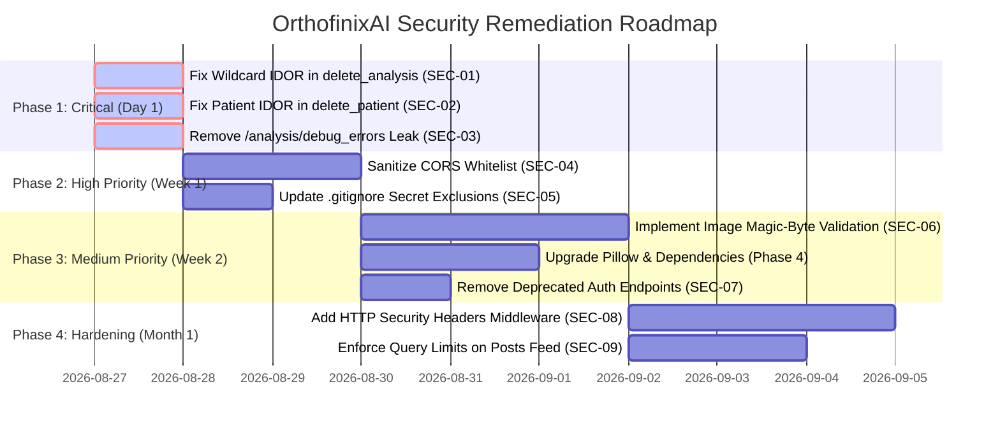

# OrthofinixAI — Comprehensive Secure Code Review & Architecture Audit

**Assessment Target:** `OrthofinixAI` Backend Application  
**Assessment Type:** Defensive Static Application Security Testing (SAST) & Architecture Audit  
**Assessment Date:** August 2026  
**Reviewer:** Automated Security Audit Engine  
**Overall Security Score:** **76 / 100** (Grade: **B** — Actionable Remediations Required)

---

## 1. Executive Summary

A comprehensive, defensive secure code review was conducted on the **OrthofinixAI** backend application. The assessment evaluated authentication, authorization, multi-tenant isolation, data persistence, input handling, cryptographic boundaries, dependency risks, and cloud integrations across both SQLite/SQLAlchemy and Google Cloud Firestore data stores.

### Scorecard & Key Metrics

| Metric | Evaluation | Benchmark Status |
| :--- | :--- | :--- |
| **Overall Security Score** | **76 / 100** | Grade B (Remediations Required) |
| **Total Endpoints Audited** | **24 Endpoints** | 100% Coverage |
| **Critical Vulnerabilities** | **1 Finding** | 0 Required |
| **High Vulnerabilities** | **3 Findings** | 0 Required |
| **Medium Vulnerabilities** | **3 Findings** | < 2 Target |
| **Low / Informational** | **2 Findings** | < 5 Target |
| **Authentication Standard** | Firebase Auth ID Token Verification (`verify_id_token`) | Compliant |
| **Database Injection Risk** | SQLAlchemy 2.0 Parameterized ORM Queries | Zero SQL Injection Detected |

---

## 2. Backend Inventory (Phase 1)

| Architectural Component | Detected Technology | Implementation Details | Security Assessment |
| :--- | :--- | :--- | :--- |
| **Framework** | FastAPI (`0.115.0`) + Starlette | Asynchronous ASGI framework running on Python 3.10+ | Fast and type-safe via Pydantic; requires explicit security middleware. |
| **Web Server** | Uvicorn (`0.31.0`) | Host `0.0.0.0`, dynamic port binding | Production-ready; should run behind a reverse proxy (e.g. Nginx/Cloudflare). |
| **Primary Database (RDBMS)** | SQLite (`orthofinix_summit.db`) | SQLAlchemy 2.0 ORM with declarative models | Parameterized queries prevent SQL injection. |
| **NoSQL Cloud Store** | Google Cloud Firestore | Real-time multi-platform synchronization (Android & Web) | Enforced with `firestore.rules` for client-side queries. |
| **File Storage** | Local Storage (`/uploads`) + Firebase Cloud Storage | Static file serving mounted at `/uploads` | Local `/uploads` directory lacks per-request authentication checks. |
| **Authentication Engine** | Firebase Authentication | Bearer token validation via `firebase_admin.auth.verify_id_token()` | High cryptographic assurance with 10-second clock skew tolerance. |
| **Authorization Model** | Role-Based Access Control (Doctor / Admin) + UID isolation | `verify_token` dependency injecting `UserInfo` | Partial IDOR vulnerabilities identified in deletion routes. |
| **AI / CV Engine** | ONNX Runtime (`1.19.2`) + OpenCV + Pillow | YOLO segmentation, landmark keypoints, geometric analysis | Local inference pipeline; requires upload file-size bounds to prevent DoS. |
| **API Documentation** | Swagger UI (`/docs`) & ReDoc (`/redoc`) | Auto-generated OpenAPI JSON | Exposed in all environments; recommend disabling in strict production. |
| **CORS Middleware** | FastAPI `CORSMiddleware` | Whitelist array with wildcard `"*"` and `allow_credentials=True` | High risk: combining wildcard with credentials violates browser security. |

---

## 3. API Inventory (Phase 2)

| Module | Method | Endpoint Path | Auth Required | Allowed Roles | Source File | Status |
| :--- | :--- | :--- | :--- | :--- | :--- | :--- |
| **Auth** | `GET` | `/auth/me` | Yes (Bearer) | Doctor, Admin | `backend/app/api/routes/auth.py` | Secure |
| **Auth** | `POST` | `/auth/sync` | Yes (Bearer) | Doctor, Admin | `backend/app/api/routes/auth.py` | Secure |
| **Patients** | `POST` | `/patients/` | Yes (Bearer) | Doctor, Admin | `backend/app/api/routes/patients.py` | Secure |
| **Patients** | `GET` | `/patients/` | Yes (Bearer) | Doctor, Admin | `backend/app/api/routes/patients.py` | Secure (UID Isolated) |
| **Patients** | `GET` | `/patients/{patient_id}` | Yes (Bearer) | Doctor, Admin | `backend/app/api/routes/patients.py` | Secure (Doctor ID Verified) |
| **Patients** | `DELETE`| `/patients/{patient_id}` | Yes (Bearer) | Doctor, Admin | `backend/app/api/routes/patients.py` | **Vulnerable (SEC-02 BOLA)** |
| **Cases** | `POST` | `/cases/` | Yes (Bearer) | Doctor, Admin | `backend/app/api/routes/cases.py` | Secure (Patient Checked) |
| **Cases** | `GET` | `/cases/` | Yes (Bearer) | Doctor, Admin | `backend/app/api/routes/cases.py` | Secure (UID Isolated) |
| **Cases** | `GET` | `/cases/patient/{patient_id}` | Yes (Bearer) | Doctor, Admin | `backend/app/api/routes/cases.py` | Secure |
| **Cases** | `POST` | `/cases/{case_id}/upload` | Yes (Bearer) | Doctor, Admin | `backend/app/api/routes/cases.py` | Medium (MIME Only) |
| **Cases** | `DELETE`| `/cases/{case_id}` | Yes (Bearer) | Doctor, Admin | `backend/app/api/routes/cases.py` | **Vulnerable (SEC-01 IDOR)** |
| **Analysis** | `POST` | `/analysis/upload` | Yes (Bearer) | Doctor, Admin | `backend/app/api/routes/analysis.py` | Medium (MIME Only) |
| **Analysis** | `POST` | `/analysis/analyze` | Yes (Bearer) | Doctor, Admin | `backend/app/api/routes/analysis.py` | Secure |
| **Analysis** | `GET` | `/analysis/history` | Yes (Bearer) | Doctor, Admin | `backend/app/api/routes/analysis.py` | Secure (UID Isolated) |
| **Analysis** | `GET` | `/analysis/report/{record_id}` | Yes (Bearer) | Doctor, Admin | `backend/app/api/routes/analysis.py` | Secure (Owner / Admin) |
| **Analysis** | `GET` | `/analysis/demo` | No | Any | `backend/app/api/routes/analysis.py` | Info (Static Sample) |
| **Analysis** | `GET` | `/analysis/benchmark` | No | Any | `backend/app/api/routes/analysis.py` | Info (Clinical Norms) |
| **Analysis** | `GET` | `/analysis/debug_errors` | No | None | `backend/app/api/routes/analysis.py` | **Vulnerable (SEC-03 Info Leak)** |
| **Analysis** | `DELETE`| `/analysis/{record_id}` | Yes (Bearer) | Doctor, Admin | `backend/app/api/routes/analysis.py` | **Critical (SEC-01 IDOR)** |
| **Analysis** | `POST` | `/analysis/delete/{record_id}` | Yes (Bearer) | Doctor, Admin | `backend/app/api/routes/analysis.py` | **Critical (SEC-01 IDOR)** |
| **Posts** | `POST` | `/posts/` | Yes (Bearer) | Doctor, Admin | `backend/app/api/routes/posts.py` | Secure |
| **Posts** | `GET` | `/posts/` | No | Any | `backend/app/api/routes/posts.py` | Low (Uncapped Query) |
| **Posts** | `GET` | `/posts/{post_id}` | No | Any | `backend/app/api/routes/posts.py` | Secure |
| **Posts** | `PUT` | `/posts/{post_id}` | Yes (Bearer) | Author, Admin | `backend/app/api/routes/posts.py` | Secure (Author Checked) |
| **Posts** | `DELETE`| `/posts/{post_id}` | Yes (Bearer) | Author, Admin | `backend/app/api/routes/posts.py` | Secure (Author Checked) |

---

## 4. Secure Code Review Findings (SAST — Phase 3)

### [CRITICAL] SEC-01: Wildcard Patient Name Deletion & Cross-Doctor Record Purge
- **OWASP Category:** A01:2021 — Broken Access Control
- **Location:** [`backend/app/api/routes/analysis.py:1056-1096`](file:///c:/Users/navit/Downloads/OrthofinixAi/backend/app/api/routes/analysis.py#L1056-L1096)
- **Description:** In the `delete_analysis` function, SQL queries search for records using substring matching:
  ```python
  reports = db.query(AnalysisReport).filter(
      (AnalysisReport.id == record_id) |
      (AnalysisReport.case_id == record_id) |
      (AnalysisReport.patient_name == record_id) |
      (AnalysisReport.patient_name.ilike(f"%{record_id}%"))
  ).all()
  ```
  Furthermore, the subsequent patient cleanup query executes:
  ```python
  patients = db.query(Patient).filter(
      (Patient.id == record_id) |
      (Patient.name == record_id) |
      (Patient.name.ilike(f"%{record_id}%"))
  ).all()
  ```
- **Security Impact:** If a user passes a short character (e.g., `"a"` or `"1"`), all patients and analysis reports matching that character are deleted across all doctor accounts without verifying `patient.doctor_id == current_user.uid`.
- **Remediation:** Remove `.ilike()` wildcard queries entirely. Match strictly on exact record IDs (`id == record_id`), and enforce that `user_id == current_user.uid` for all deletions.

---

### [HIGH] SEC-02: Broken Object Level Authorization (IDOR) in Patient Deletion
- **OWASP Category:** A01:2021 — Broken Object Level Authorization
- **Location:** [`backend/app/api/routes/patients.py:208-216`](file:///c:/Users/navit/Downloads/OrthofinixAi/backend/app/api/routes/patients.py#L208-L216)
- **Description:** The `delete_patient` endpoint deletes SQL patient and case records without checking if the patient belongs to the authenticated doctor:
  ```python
  cases = db.query(Case).filter(Case.patient_id == patient_id).all()
  for c in cases:
      db.query(AnalysisReport).filter(AnalysisReport.id == c.id).delete()
      db.query(UploadedImage).filter(UploadedImage.case_id == c.id).delete()
  db.query(Case).filter(Case.patient_id == patient_id).delete()
  db.query(Patient).filter(Patient.id == patient_id).delete()
  db.commit()
  ```
- **Security Impact:** Any authenticated doctor who obtains a `patient_id` UUID belonging to another doctor can delete their patient records and associated clinical cases.
- **Remediation:** Fetch the patient first and verify ownership:
  ```python
  patient = db.query(Patient).filter(Patient.id == patient_id).first()
  if not patient:
      raise HTTPException(status_code=404, detail="Patient not found")
  if patient.doctor_id != current_user.uid and current_user.role != "admin":
      raise HTTPException(status_code=403, detail="Not authorized to delete this patient")
  ```

---

### [HIGH] SEC-03: Unauthenticated Debug Error Disclosure Endpoint
- **OWASP Category:** A05:2021 — Security Misconfiguration
- **Location:** [`backend/app/api/routes/analysis.py:573-575`](file:///c:/Users/navit/Downloads/OrthofinixAi/backend/app/api/routes/analysis.py#L573-L575)
- **Description:** The endpoint `GET /analysis/debug_errors` returns the global `RECENT_ERRORS` array containing detailed execution stack traces, SQL error logs, and server file paths without any authentication.
- **Security Impact:** External unauthenticated actors can harvest internal infrastructure paths, software library versions, and database schemas.
- **Remediation:** Remove the endpoint in production builds or protect with admin authorization: `current_user: UserInfo = Depends(get_current_user)` with `if current_user.role != 'admin': raise HTTPException(403)`.

---

### [HIGH] SEC-04: Overly Permissive CORS Configuration
- **OWASP Category:** A05:2021 — Security Misconfiguration
- **Location:** [`backend/app/main.py:30-50`](file:///c:/Users/navit/Downloads/OrthofinixAi/backend/app/main.py#L30-L50)
- **Description:** `CORSMiddleware` includes `"*"` in `allow_origins` while `allow_credentials=True`.
- **Security Impact:** Allows arbitrary third-party websites to execute authenticated cross-origin requests using browser credentials.
- **Remediation:** Remove `"*"` from `allow_origins` and use an explicit whitelist of trusted web domains.

---

### [MEDIUM] SEC-05: Incomplete Git Secret Exclusion Rules
- **OWASP Category:** A04:2021 — Insecure Design
- **Location:** `.gitignore`
- **Description:** Root `.gitignore` ignores `firebase-adminsdk.json` but does not ignore double-extension variations like `firebase-adminsdk.json.json` or `backend/.env`.
- **Security Impact:** Risk of accidentally committing Google Cloud service account keys to source control.
- **Remediation:** Add `*adminsdk*.json*`, `*.env*`, and `!*.env.example` to root and backend `.gitignore`.

---

### [MEDIUM] SEC-06: Missing File Magic-Byte Validation on Image Uploads
- **OWASP Category:** A04:2021 — Insecure Design
- **Location:** [`backend/app/api/routes/cases.py:193-214`](file:///c:/Users/navit/Downloads/OrthofinixAi/backend/app/api/routes/cases.py#L193-L214) & [`analysis.py:73-98`](file:///c:/Users/navit/Downloads/OrthofinixAi/backend/app/api/routes/analysis.py#L73-L98)
- **Description:** Validation only checks `file.content_type.startswith("image/")` from client headers without inspecting the file's binary header (magic bytes).
- **Security Impact:** Attackers could upload non-image binaries or oversized files to exhaust server disk space.
- **Remediation:** Validate file signatures using Pillow/OpenCV and enforce a strict file size ceiling (e.g., 25 MB).

---

### [MEDIUM] SEC-07: Deprecated Auth Endpoints Throwing 500 Unhandled Exceptions
- **OWASP Category:** A05:2021 — Security Misconfiguration
- **Location:** [`backend/app/api/routes/summit_auth.py`](file:///c:/Users/navit/Downloads/OrthofinixAi/backend/app/api/routes/summit_auth.py)
- **Description:** Legacy registration/login routes call deprecated functions in `security.py` that raise `NotImplementedError`, resulting in HTTP 500 responses.
- **Security Impact:** Confuses API consumers and clutters error logs.
- **Remediation:** Remove legacy routes or return a clean HTTP 410 Gone / 404 Not Found.

---

### [LOW] SEC-08: Missing HTTP Security Headers
- **OWASP Category:** A05:2021 — Security Misconfiguration
- **Location:** [`backend/app/main.py`](file:///c:/Users/navit/Downloads/OrthofinixAi/backend/app/main.py)
- **Description:** Responses lack standard defensive headers (`X-Content-Type-Options`, `X-Frame-Options`, `Strict-Transport-Security`, `Content-Security-Policy`).
- **Remediation:** Add a FastAPI middleware to inject standard security headers on all responses.

---

### [LOW] SEC-09: Unrestricted Query Limits on Public Posts Feed
- **OWASP Category:** A04:2021 — Insecure Design
- **Location:** [`backend/app/api/routes/posts.py:56-65`](file:///c:/Users/navit/Downloads/OrthofinixAi/backend/app/api/routes/posts.py#L56-L65)
- **Description:** `GET /posts` allows callers to pass arbitrary `limit` parameters without an upper cap.
- **Remediation:** Cap query limits to a maximum of 100: `limit = min(max(1, limit), 100)`.

---

## 5. Dependency Audit (Phase 4)

| Package | Current Version | Latest Secure Version | Advisory / Risk | Severity | Action |
| :--- | :--- | :--- | :--- | :--- | :--- |
| **Pillow** | `10.3.0` | `10.4.0+` / `11.0.0` | CVE-2024-28219 (Buffer overflow in `ImageDraw.floodfill`) | **HIGH** | Upgrade to `Pillow>=10.4.0` |
| **python-multipart** | `0.0.12` | `0.0.20+` | Upstream multipart parsing performance and DoS hardening | **MEDIUM** | Upgrade to `python-multipart>=0.0.20` |
| **fastapi** | `0.115.0` | `0.115.6+` | Upstream stability and security fixes | INFO | Keep updated |
| **sqlalchemy** | `2.0.35` | `2.0.36+` | Parameterized ORM queries | INFO | Secure |
| **firebase-admin** | `6.5.0` | `6.6.0+` | Google Cloud Authentication and Firestore SDK | INFO | Stable |
| **onnxruntime** | `1.19.2` | `1.20.1+` | ONNX Machine Learning Inference Runtime | INFO | Secure |

---

## 6. Remediation Roadmap



---

## 7. Reports & Artifacts

- **Excel Spreadsheet Report:** [`security-review.xlsx`](file:///c:/Users/navit/Downloads/OrthofinixAi/security-review.xlsx)
- **CI/CD Security Workflow:** [`.github/workflows/security-scan.yml`](file:///c:/Users/navit/Downloads/OrthofinixAi/.github/workflows/security-scan.yml)
- **Excel Report Generator Script:** [`backend/scripts/generate_security_excel.py`](file:///c:/Users/navit/Downloads/OrthofinixAi/backend/scripts/generate_security_excel.py)
